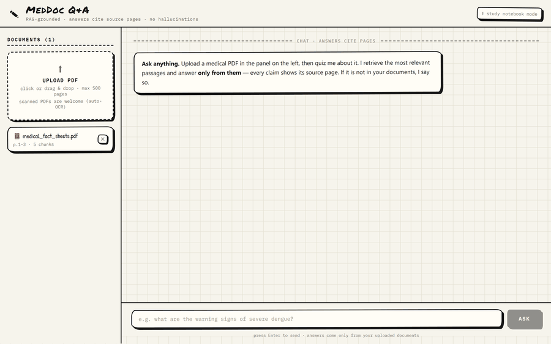
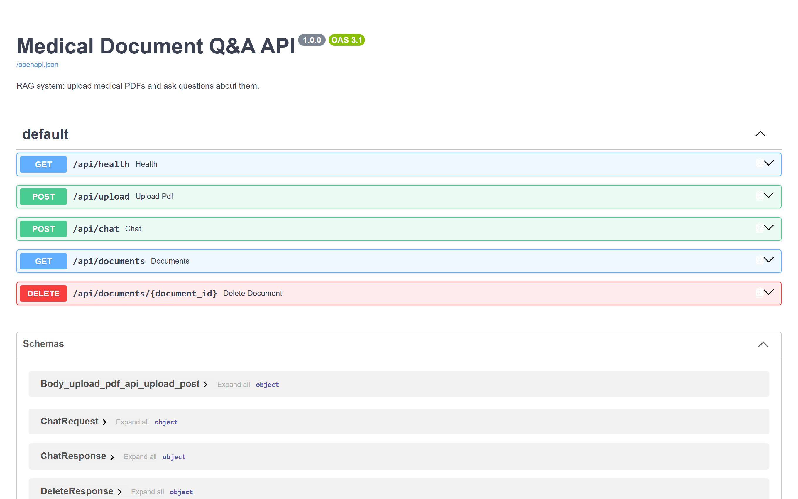
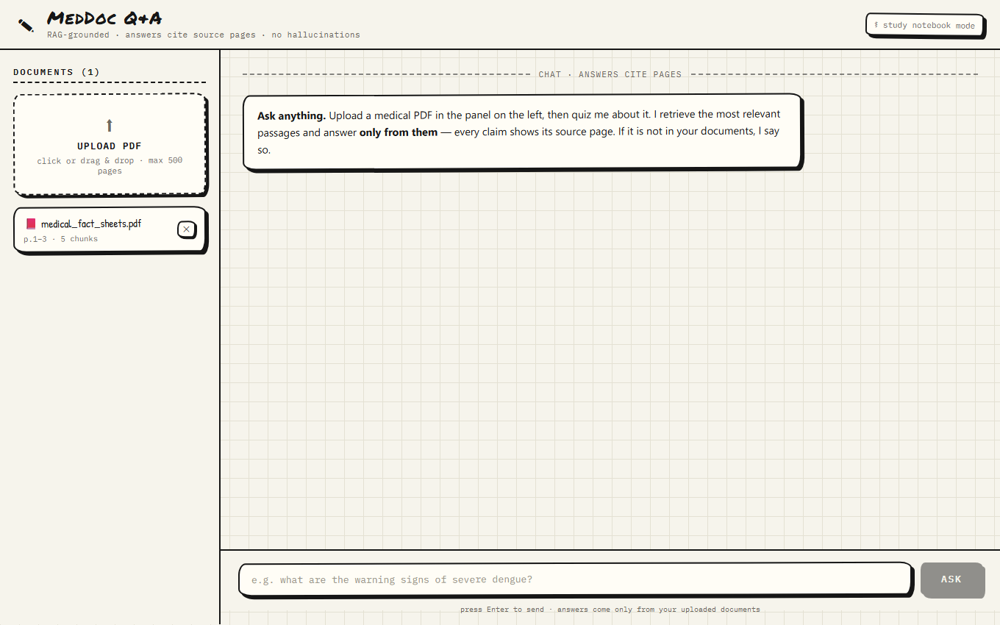
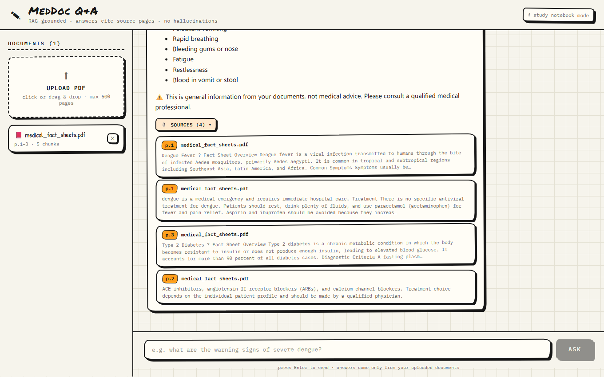

# 🩺 MedDoc Q&A — Medical Document RAG System

> **🚀 Live demo:** *coming soon — deploying now.* &nbsp;|&nbsp; **Backend API:** *coming soon*

[](https://render.com/deploy?repo=https://github.com/sanzizlohar/medical-rag)


Upload medical PDFs (guidelines, fact sheets, reports) and ask questions about them.
Answers are generated by **Google Gemini** strictly from your documents, with **page-level
source citations** and a built-in medical disclaimer. Scanned PDFs are welcome — pages
without a text layer are **OCR'd locally** before indexing.

| Layer    | Tech                                                                 |
|----------|----------------------------------------------------------------------|
| Backend  | Python 3.10+, FastAPI, LangChain, FAISS, PyMuPDF, RapidOCR           |
| LLM      | Google Gemini (`gemini-3.6-flash`) + `gemini-embedding-001`          |
| Frontend | React 18 + Vite — hand-drawn neo-brutalist "study notebook" UI       |

## 🎬 Demo

**Ask anything — the answer streams in with clickable sources.** Gemini retrieves the
top-4 matching chunks and answers *only* from them:



**Upload a PDF — it's parsed, chunked, embedded, and indexed in seconds**
(scanned pages are OCR'd locally during this step):


The backend also ships with auto-generated interactive API docs (Swagger UI):



<details>
<summary>More screenshots (static)</summary>

| Home — notebook workspace | Grounded answer with cited sources |
|---|---|
|  |  |

</details>

## How it works

1. **Upload** — a PDF is parsed page-by-page (PyMuPDF). Pages with no text layer
   (scans) are **OCR'd locally with RapidOCR** (bundled ONNX models, runs on CPU) —
   text and scanned pages then take the same path: split into ~1,000-char chunks
   with 150-char overlap, embedded with Gemini embeddings, and stored in a
   per-document FAISS index on disk (`backend/faiss_indexes/`).
2. **Ask** — your question is embedded, the top-4 most similar chunks across all
   documents are retrieved, and Gemini answers **only from that context**. Unknown
   questions get "I could not find this information…" instead of a hallucinated answer.
3. **Citations** — every answer lists the source document + page numbers, shown in an
   expandable Sources panel in the UI.

## Setup

### 1. Backend

```bash
cd backend
pip install -r requirements.txt
```

Create `backend/.env` (copy `.env.example`) and paste your key from
[Google AI Studio](https://aistudio.google.com/apikey) (free tier works):

```
GOOGLE_API_KEY=your-key-here
GEMINI_MODEL=gemini-3.6-flash
EMBEDDING_MODEL=models/gemini-embedding-001
```

Start the API:

```bash
python -m uvicorn app.main:app --port 8000
```

Interactive API docs: http://localhost:8000/docs

### 2. Frontend

```bash
cd frontend
npm install
npm run dev
```

Open http://localhost:5173 — the Vite dev server proxies `/api` to the backend.

## ☁️ Deploy your own (free)

| Piece | Host | Cost |
|---|---|---|
| Frontend (React) | Cloudflare Pages | free |
| Backend (FastAPI) | Render free tier | free |

**Backend:** click the **Deploy to Render** button above (uses the included
`render.yaml` blueprint). You'll paste your `GOOGLE_API_KEY`, and set
`CORS_ORIGINS` to your frontend URL after the frontend is deployed.
⚠️ Free tier: sleeps after 15 min idle (~50 s cold start) and has an ephemeral
disk — re-upload PDFs after a redeploy.

**Frontend:** Cloudflare dashboard → Workers & Pages → Create → Pages → connect
this repo → root directory `frontend`, framework preset **Vite**, build command
`npm run build`, output `dist`, and environment variable
`VITE_API_URL=https://<your-render-service>.onrender.com/api`.

## Running the project

### Quick way (Windows)

Double-click **`start.bat`** — it opens two terminal windows (backend + frontend),
installing frontend dependencies first if needed. Then open
[http://localhost:5173](http://localhost:5173).

### Manual way (any OS, e.g. from VS Code)

Open the `medical-rag` folder in VS Code, then open two terminals
(`Ctrl+Shift+\` splits, or use the Terminal panel's `+`):

**Terminal 1 — backend** (first time: `pip install -r requirements.txt` and create
`backend/.env` from `.env.example` with your `GOOGLE_API_KEY`):

```bash
cd backend
python -m uvicorn app.main:app --port 8000
```

**Terminal 2 — frontend** (first time: `npm install`):

```bash
cd frontend
npm run dev
```

Then open [http://localhost:5173](http://localhost:5173). Stop a server with `Ctrl+C`
in its terminal. API docs live at [http://localhost:8000/docs](http://localhost:8000/docs).

> **Fresh clone note:** `.env`, `uploads/`, and `faiss_indexes/` are gitignored, so a
> new clone starts empty — create `.env` from `.env.example`, and upload PDFs through
> the UI (or run `python sample_data/make_sample_pdf.py` to regenerate the sample).

### Trying it out

A sample PDF (dengue / hypertension / type-2-diabetes fact sheets) is included:

```bash
cd backend
python sample_data/make_sample_pdf.py      # regenerate sample_data/medical_fact_sheets.pdf
```

Upload it in the app, then ask things like:

- *"What are the warning signs of severe dengue?"*
- *"What is the diagnostic criteria for type 2 diabetes?"*
- *"Which medicines should be avoided in dengue fever and why?"*

## API reference

| Method   | Endpoint                  | Description                        |
|----------|---------------------------|------------------------------------|
| `GET`    | `/api/health`             | Status + whether API key is set    |
| `POST`   | `/api/upload`             | Upload PDF (multipart `file`)      |
| `POST`   | `/api/chat`               | `{ "question": "..." }` → answer + sources |
| `GET`    | `/api/documents`          | List ingested documents            |
| `DELETE` | `/api/documents/{id}`     | Delete a document and its index    |

## Project layout

```
medical-rag/
├── backend/
│   ├── app/
│   │   ├── main.py        # FastAPI routes
│   │   ├── ingest.py      # PDF → chunks → FAISS index
│   │   ├── rag_chain.py   # retrieval + grounded Gemini answer
│   │   ├── config.py      # env/settings
│   │   └── schemas.py     # request/response models
│   ├── sample_data/       # sample PDF generator + PDF
│   ├── uploads/           # stored PDFs
│   └── faiss_indexes/     # per-document vector indexes (gitignored)
└── frontend/
    └── src/
        ├── App.jsx                  # chat panel + message bubbles
        ├── components/DocumentPanel.jsx  # upload + document list
        └── index.css                # medical theme
```

## Notes & limitations

- **Not medical advice.** The system only summarizes the documents you upload and
  always appends a consult-a-professional disclaimer.
- **Limits:** PDFs up to **25 MB** and **500 pages** (≈ up to 5,000 chunks) by default —
  tune `MAX_PAGES` / `MAX_CHUNKS` in `backend/.env`. Oversized PDFs are rejected with a
  clear message instead of failing mid-ingestion.
- **Scanned PDFs are supported** via local OCR (RapidOCR): pages with no text layer are
  rendered to images and recognized on your CPU before indexing. This makes ingestion
  slower for scans (roughly 5–15 s per page). Disable with `OCR_ENABLED=false`, or tune
  quality/speed with `OCR_DPI`.
- Retrieval searches every ingested document; for large libraries (100+ docs), add a
  document filter or a merged index.
- Ingestion runs inside the upload request: a few hundred pages takes a minute or two
  (embeddings are batched 100 chunks per API call). Concurrent uploads are safe —
  manifest writes are lock-protected.
